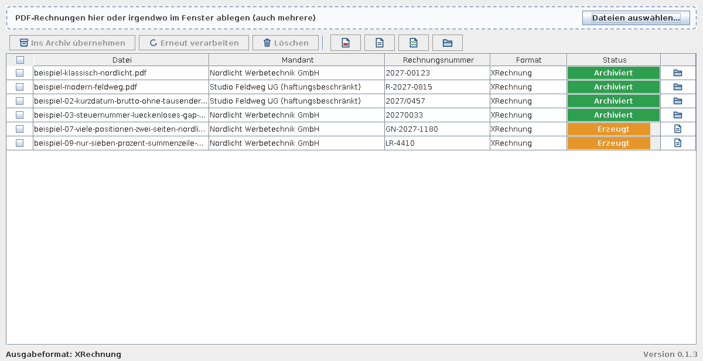
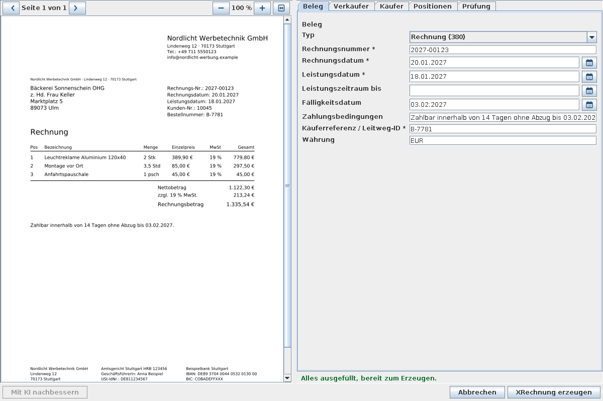
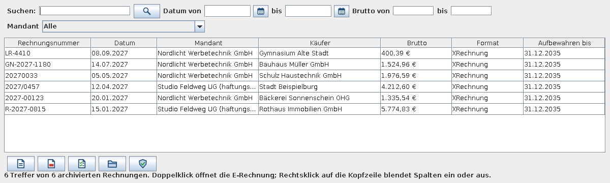

# E-Rechnung-Tool


Das Tool nimmt PDF-Ausgangsrechnungen per Drag & Drop entgegen und erzeugt daraus eine **XRechnung** oder ein **ZUGFeRD** (Profil EN 16931). Es prüft das Ergebnis, erstellt ein Prüf-Protokoll und legt alles mit Hashes im Archiv ab (Änderungen werden nachweisbar).

> **Machbarkeitsstudie:** Das Tool ist ein Proof of Concept (Version 0.x), kein fertiges oder abgenommenes Produkt. Setzen Sie es nur ein, wenn Sie jedes Ergebnis selbst prüfen; für den produktiven, steuerlich relevanten Einsatz ist es nicht freigegeben.
>
> **Wichtig:** Das Tool unterstützt beim Erstellen von E-Rechnungen. Die Daten werden aus dem PDF **vorgeschlagen**, Sie bestätigen sie in der Prüfmaske. Das Prüf-Protokoll bestätigt nur die **formale Konformität** des Ausgabeformats, nicht die inhaltliche Richtigkeit. Die inhaltliche Verantwortung liegt beim Rechnungsaussteller. Rechtliche Fragen (Fristen, Aufbewahrung, Behandlung von PDF-Original und E-Rechnung) bitte mit der Steuerberatung klären.

**1. Import:** PDFs im Fenster ablegen, die Übersicht zeigt den Stand je Rechnung.



**2. Prüfen:** Die Daten aus dem PDF werden vorgeschlagen, Sie bestätigen sie in der Prüfmaske.



**3. Archiv:** Übernommene Rechnungen sind durchsuchbar und mit Hashes und Prüf-Protokoll abgelegt.



## Start

1. **Vor dem Entpacken** die ZIP-Datei im Explorer mit Rechtsklick → Eigenschaften → Haken bei **„Zulassen“** → OK entsperren (siehe Hinweis unten).
2. ZIP entpacken (zum Beispiel auf den Desktop). Es wird nichts installiert, es gibt keine Registry-Einträge und keine Admin-Rechte.
3. `start.cmd` ausführen.

**Windows-Sicherheitswarnung „Herausgeber konnte nicht verifiziert werden“:** Windows markiert aus dem Internet geladene Dateien und warnt bei ausführbaren Skripten, die keine digitale Signatur tragen. Das ist kein Virenfund, sondern heißt nur, dass das Programm (noch) nicht signiert ist. Entsperren Sie die ZIP vor dem Entpacken (Schritt 1). Falls Sie schon entpackt haben, entsperren Sie den Ordner in PowerShell: `Get-ChildItem -Recurse "C:\Pfad\E-Rechnung" | Unblock-File`. Wer die Herkunft prüfen möchte, baut das Programm selbst aus dem Quellcode (siehe Entwicklung). Auf Rechnern mit Richtlinien wie AppLocker oder Smart App Control kann der Start zusätzlich von der IT freigegeben werden müssen.

Das Tool schreibt in den **Archivordner** (Standard: `archiv/` neben `start.cmd`) und in den Ordner **`daten/`** (Konfiguration, Mandanten, Protokoll, Zwischenspeicher). **Updates** legen zusätzlich neue Programmversionen unter `versionen/` ab und erneuern beim Start `start.cmd` und `launcher/launcher.jar`; der Programmordner muss deshalb beschreibbar sein. Wer das Tool mit AppLocker oder Ähnlichem freigibt, sollte den Pfad `versionen/` freigeben oder Updates nicht nutzen.

## Bedienung

1. PDF-Rechnungen auf das Fenster ziehen (auch mehrere; oder „Dateien auswählen…"). Jede PDF erscheint als Zeile in der Übersicht mit einem Fortschrittsbalken.
2. Wird der Rechnungsaussteller nicht erkannt, erscheint „Neuer Rechnungsaussteller erkannt". Daten prüfen, ergänzen, „Anlegen".
3. In der **Prüfmaske** links das PDF: Das **Mausrad zoomt** (um die Stelle unter dem Mauszeiger), ebenso −, + und „Einpassen“; mit gedrückter Maustaste verschieben Sie den Ausschnitt, Umschalt + Mausrad scrollt. Rechts die Angaben in Tabs: **Beleg**, **Verkäufer** (die Stammdaten des Ausstellers, hier änderbar; Änderungen werden im Mandanten gespeichert), **Käufer**, **Positionen** und **Prüfung** (Summenabgleich, offene Punkte, Hinweise aus dem Auslesen). Unter den Tabs steht immer, ob noch etwas zu klären ist; der Tab „Prüfung“ zeigt die Anzahl offener Punkte. „XRechnung erzeugen" bzw. „ZUGFeRD erzeugen" (je nach Ausgabeformat) wird erst aktiv, wenn nichts mehr offen ist. Weichen die Summen im PDF von den berechneten ab, müssen Sie das ausdrücklich bestätigen (die Bestätigung wird im Archiv festgehalten). Rabattzeilen werden als negative Menge mit positivem Preis erfasst.
4. Das Tool erzeugt die E-Rechnung und prüft sie formal, **legt sie aber noch nicht im Archiv ab**. Die Zeile steht auf „Erzeugt". Per Doppelklick oder Rechtsklick → „E-Rechnung ansehen" / „Prüfprotokoll ansehen" prüfen Sie das Ergebnis.
5. Sind Sie einverstanden, übernehmen Sie sie mit „Ins Archiv übernehmen". Erst dann liegt sie unveränderlich im Archiv (mit Hashes und Protokolleintrag). Der Beleg-Status wird dabei automatisch nach Datum bestimmt und in `daten.json` festgehalten.

**Auswahl für mehrere Zeilen:** Ein Klick auf eine Zeile setzt ihr Häkchen vorne (Strg- oder Umschalt-Klick wählt mehrere, ein Klick auf das Häkchen schaltet nur diese Zeile um). Die Checkbox in der Kopfzeile wählt alle Zeilen aus oder ab. Die Knöpfe über der Tabelle gelten für die ausgewählten Zeilen: **Ins Archiv übernehmen** (erzeugte E-Rechnungen), **Erneut verarbeiten** (abgebrochene oder fehlgeschlagene PDFs; die Prüfmaske erscheint wieder) und **Löschen** (entfernt abgeschlossene Zeilen aus der Übersicht; nicht archivierte E-Rechnungen werden verworfen, die PDF-Dateien bleiben). Dasselbe bietet das Kontextmenü (Rechtsklick), Entf löscht. Ein **Rechtsklick auf die Kopfzeile** blendet Spalten ein oder aus (wird gemerkt). Die Ordner-Spalte zeigt ein Symbol; der Pfad steht im Hilfetext, ein Klick öffnet den Ordner.

Erzeugte, noch nicht übernommene E-Rechnungen gelten nur für die laufende Sitzung. Beim Beenden fragt das Tool nach und verwirft sie. Ein Klick auf das Ordner-Symbol einer archivierten Zeile öffnet den Archivordner, bei einem erzeugten Entwurf die E-Rechnung.

## Konfiguration und Mandanten (je ein eigener Menüpunkt)

- **Archivordner** und **Ordnervorlage** mit den Platzhaltern `{Mandant}`, `{Jahr}`, `{Monat}`, `{Rechnungsnummer}`. Standard: `{Mandant}/{Jahr}/{Monat}/{Rechnungsnummer}`.
- **Ausgabeformat:** XRechnung (reines XML) oder ZUGFeRD (PDF/A-3 mit eingebettetem XML).
- **Mandanten** (Menü Mandanten): Rechnungsaussteller verwalten. Beim Anlegen und Bearbeiten (und im Tab „Verkäufer“ der Prüfmaske) liest **„Mit KI aus einer Rechnung ausfüllen …“** die Stammdaten aus dem Rechnungstext und schlägt sie feldweise vor; so lassen sich auch vorhandene Aussteller aktualisieren (dann wählen Sie eine Rechnung dieses Ausstellers). Pflicht sind Anschrift, USt-IdNr. oder Steuernummer, E-Mail und IBAN. **Ansprechpartner, Telefon und Käuferreferenz (Leitweg-ID)** verlangt nur die XRechnung; bei ZUGFeRD sind sie optional.

## Archiv

Pro Rechnung ein Ordner:

```
Archiv/Muster GmbH/2027/01/RE-2027-0001/
  vorlage-original.pdf     die abgelegte PDF-Vorlage, unverändert (geht nicht an den Kunden)
  ausgabe-xrechnung.xml    oder ausgabe-zugferd.pdf
  pruefprotokoll.html      Ergebnis der Format-Prüfung
  daten.json               bestätigte Felder, Hashes (SHA-256), Beleg-Status, Aufbewahrung bis
```

Archivierte Rechnungen werden vom Tool nie überschrieben, bearbeitet oder gelöscht. Änderungen an Dateien lassen sich über die SHA-256-Hashes in `daten.json` und die Hash-Kette in `daten/protokoll.jsonl` nachweisen. Das Tool setzt keinen Dateischreibschutz. Aufbewahrung: 8 Jahre ab Ende des Ausstellungsjahres (`retainUntil` in `daten.json`).

Der Menüpunkt **Archiv** öffnet direkt das Archiv. Dort suchen Sie nach Rechnungsnummer, Käufer, Ort oder Mandant, nach Datum (mit Kalender) und Betrag. Unter der Liste öffnen Knöpfe mit Symbol die E-Rechnung, die Vorlage (Original-PDF), das Prüfprotokoll und den Ordner; der letzte Knopf startet die Integritätsprüfung (Namen im Hilfetext); sie läuft außerdem bei jedem Start und meldet sich dann nur bei Abweichungen. Ein Rechtsklick auf die Kopfzeile blendet Spalten ein oder aus (Beleg-Status und Tool-Version sind zunächst ausgeblendet). Datumsfelder in der Prüfmaske und im Archiv haben einen **Kalender** (Symbol neben dem Feld).

## Bekannte Grenzen

- **ZUGFeRD** braucht ein PDF mit eingebetteten Schriften (nicht eingebettete wie Helvetica werden abgelehnt). Abhilfe: PDF mit eingebetteten Schriften erzeugen oder XRechnung wählen.
- **Auslesen** ist regelbasiert und nur ein Vorschlag; bei ungewöhnlichen Layouts ist mehr Korrektur nötig.
- **Archiv** (Menü „Archiv“): Suche nach Nummer, Käufer, Ort, Datum, Betrag und Mandant. Die **Integritätsprüfung** (beim Start und im Menü) vergleicht Dateien mit den Hashes in `daten.json` und dem Protokoll. Änderungen werden nachweisbar, nicht verhindert.
- **KI-Hilfe** (Konfiguration → KI, Standard: aus) schlägt Felder vor (Claude API oder OpenAI-kompatibel), in der Prüfmaske für die Rechnung und beim Rechnungsaussteller für dessen Stammdaten. Während die KI arbeitet, zeigt ein Fenster die Laufzeit und bietet Abbrechen (das Tool wartet bis zu 5 Minuten auf die Antwort). Gesendet wird erst nach Bestätigung des angezeigten Rechnungstexts; der Key bleibt standardmäßig im Arbeitsspeicher.
- **Updates** (Hilfe → Nach Updates suchen): auf Klick, auf Wunsch beim Start (Konfiguration → Allgemein → Updates → „Beim Start nach Updates suchen“, Standard aus). Ein anderes Repository oder ein Token für ein privates Repository (Fork) steht in `daten/update.json` (`repo`, `token`). Das Paket kommt aus den GitHub-Releases dieses Repositories, wird per SHA-256 und per Ed25519-Signatur geprüft (ein nicht oder falsch signiertes Release wird nicht installiert; für einen Fork mit eigenem Schlüssel steht der öffentliche Schlüssel Base64-kodiert in `daten/update.json` als `signingKey`) und beim nächsten Start eingespielt. Jede Version liegt in einem eigenen Ordner unter `versionen/`, `versionen/aktuell.txt` bestimmt, welche startet; ein Update löscht oder überschreibt dabei nichts. Startet eine neu eingespielte Version nicht, stellt der nächste Start die vorherige automatisch wieder her (Zeiger zurück, `versionen/vorher.txt`).

## Lizenz und Haftung

Copyright 2026 E-Rechnung-Tool contributors. Das Projekt steht unter der [Apache License 2.0](LICENSE); Hinweise zu Drittkomponenten stehen in [NOTICE](NOTICE). Die Software wird **ohne Gewährleistung und ohne Haftung** bereitgestellt, soweit gesetzlich zulässig (Abschnitte 7 und 8 der Lizenz). Beim ersten Start muss ein Nutzungs- und Haftungshinweis bestätigt werden (Bestätigung in `daten/hinweis.json` und im Protokoll; später unter Hilfe → Nutzungs- und Haftungshinweis). Die inhaltliche Verantwortung für Rechnungen liegt beim Rechnungsaussteller.

## Unterstützung

Das Tool ist kostenlos und Open Source. Wer das Projekt freiwillig unterstützen möchte, kann dem Entwickler [einen Kaffee spendieren](https://buymeacoffee.com/ebolansk) (auch im Programm unter Hilfe → Projekt unterstützen). Das ist freiwillig und begründet keinen Anspruch auf Leistung, Support oder bestimmte Funktionen.

## Mitwirken und Sicherheit

Fehler, Ideen und Pull Requests sind willkommen: siehe [CONTRIBUTING.md](CONTRIBUTING.md) und den [Verhaltenskodex](CODE_OF_CONDUCT.md). Sicherheitslücken bitte vertraulich melden ([SECURITY.md](SECURITY.md)). Änderungen pro Version stehen im [CHANGELOG](CHANGELOG.md). Beispielrechnungen (alle erfunden) liegen in [`beispiele/`](beispiele/).

## Entwicklung

```bash
scripts/setup-tools.sh     # lädt JDK 21 und Maven nach .tools/
scripts/test.sh            # alle Tests
scripts/build-dist.sh      # baut dist/E-Rechnung und das ZIP für Windows x64
```

Release: Version in `pom.xml` und `Version.java` erhöhen, `scripts/build-dist.sh`, dann `scripts/release.sh` (fragt vor dem Veröffentlichen nach).
